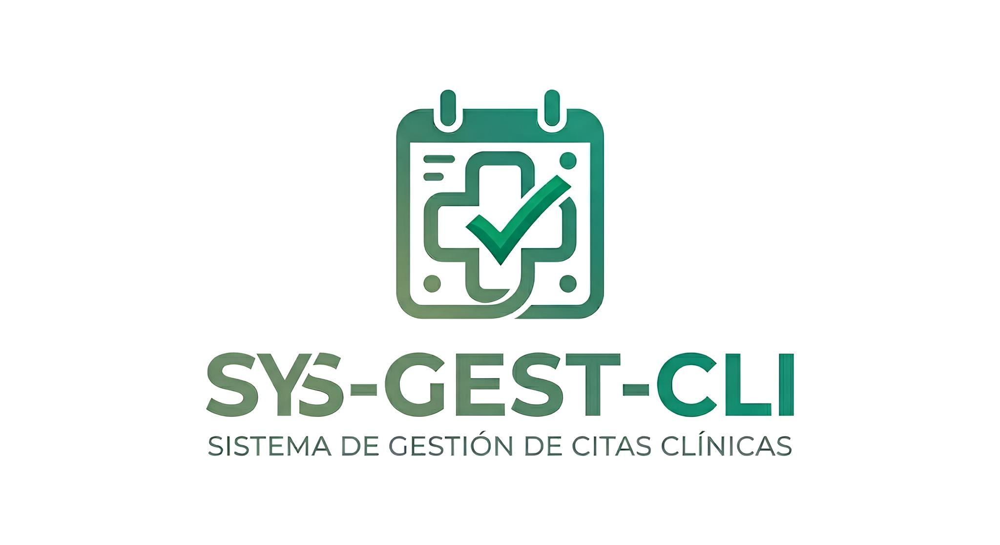
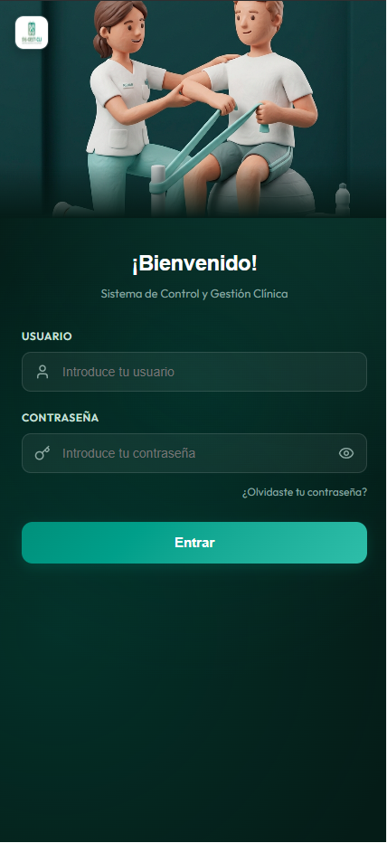
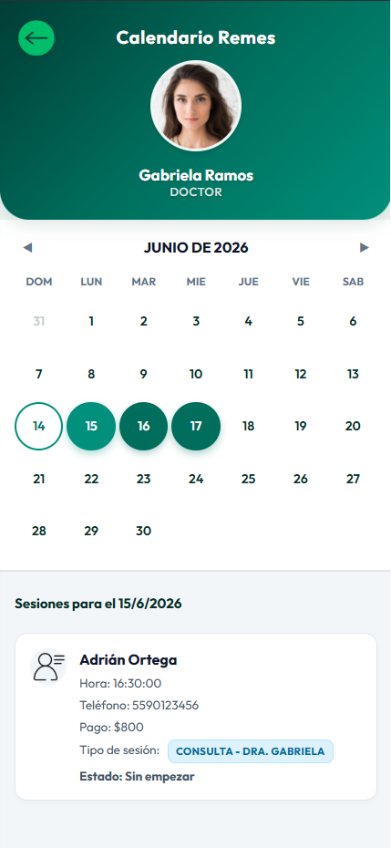
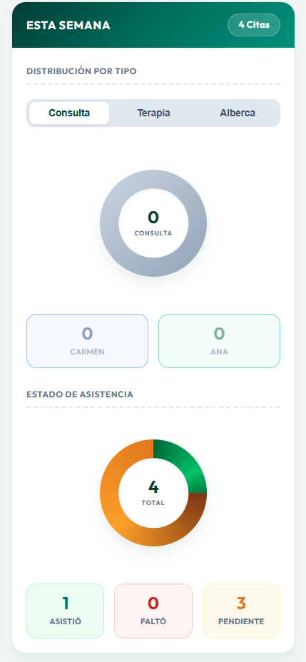

#  SYS-GEST-CLINIC: Sistema de Gestión y Control de Citas Clínicas

<p align="center">
  
</p>

**SYS-GEST-CLINIC** es una solución digital integral y premium diseñada para optimizar y automatizar el control de agendas, expedientes de pacientes y reportes operativos en clínicas de fisioterapia y rehabilitación física.

---

##  Propósito del Proyecto

Este proyecto nació con el objetivo de apoyar a **micro, pequeñas y medianas empresas (MiPyMEs)** del sector salud a dar el salto hacia la transformación digital. Muchas clínicas operan con registros manuales en papel u hojas de cálculo propensas a errores. **SYS-GEST-CLINIC** proporciona una plataforma centralizada y accesible que:
*   Previene la duplicidad y el empalme de citas.
*   Automatiza el cálculo de cobros y adeudos por paciente.
*   Facilita la toma de decisiones administrativas mediante estadísticas visuales de rendimiento.
*   Simplifica la administración diaria del personal clínico y administrativo en un solo lugar.

---

##  Galería y Recorrido Visual de la Aplicación

A continuación se detallan las interfaces clave del sistema utilizando capturas reales de la aplicación:

###  1. Pantalla de Inicio de Sesión (Login)
Una pantalla de acceso segura diseñada bajo directrices de minimalismo utilitario oscuro. Cuenta con una ilustración 3D de fisioterapia personalizada y campos con prefijos de iconos interactivos para guiar al usuario.



### 🎛️ 2. Panel Principal (Dashboard)
El menú de inicio móvil (Mobile First) permite al personal de salud acceder rápidamente a todas las herramientas del sistema: consultar calendarios, ver citas asignadas, agregar nuevos pacientes o analizar el historial.


###  3. Calendario Clínico Interactivo
Un calendario mensual dinámico que resalta los días con citas programadas y permite a los especialistas ver el detalle horario de cada consulta, sesión terapéutica o rehabilitación en alberca, con badges de colores asociados.



###  4. Estadísticas y Reportes Operativos
Un panel inteligente de Business Intelligence (BI) que procesa las asistencias y los tipos de sesión en tiempo real para generar métricas semanales, mensuales y anuales de la clínica, distribuidas por terapeuta.



###  5. Registro de Pacientes
Formulario intuitivo y optimizado para dar de alta a nuevos pacientes, recopilando información clave como contacto, aseguradora y el médico que los remite.


### 🩺 6. Notas Iniciales del Paciente
Modal flotante para agregar instrucciones médicas especiales, precauciones o diagnósticos de entrada para la rehabilitación del paciente.


### 📋 7. Listado General de Pacientes
Un listado dinámico e interactivo de todos los pacientes en el sistema, con buscador por nombre o teléfono en tiempo real y botones directos para gestionar notas, agendar citas o editar información.


### 🗂️ 8. Pacientes Asignados (Mis Pacientes)
Espacio de trabajo para el terapeuta donde puede ver las tarjetas de sus pacientes programados, registrar asistencias y gestionar sus sesiones individuales.


### 📝 9. Ventana Emergente de Consulta (Valoración)
Ventana emergente en la que el médico o terapeuta redacta la valoración de la consulta antes de generar y exportar la receta o nota médica formal.


### 📄 10. Documento PDF Exportado
La nota de valoración final en formato PDF generada dinámicamente. Cuenta con un diseño premium y limpio que incluye los datos del paciente, del terapeuta, la nota médica y áreas de firmas.


### 📷 11. Gestión de Perfil e Imagen
Un menú deslizable inferior (bottom sheet) que permite a los usuarios cambiar su foto de perfil utilizando archivos locales o la cámara web en vivo.


### ⚠️ 12. Validaciones y Manejo de Errores
El sistema muestra retroalimentación visual clara y elegante en caso de errores en los formularios, fallas en la red o colisiones de citas en la agenda.


---

##  Módulos y Funcionalidades Detalladas

1.  **Autenticación y Perfiles Personalizados:**
    *   Acceso con roles diferenciados para Médicos Directores y Fisioterapeutas.
    *   Migración automática de contraseñas de texto plano a encriptación Bcrypt en el primer inicio de sesión.
    *   Gestión de avatares con recorte y captura por cámara web en vivo.
2.  **Gestión de Expedientes de Pacientes:**
    *   Registro de datos de aseguradoras, médico remitente, contacto e indicaciones clínicas especiales.
    *   Historial de notas del paciente actualizable de forma rápida.
    *   Actualización automática del adeudo total según el costo de las sesiones programadas.
3.  **Agenda Inteligente con Bloqueo de Colisiones:**
    *   Permite agendar Consultas ($800), Terapias ($350) y Sesiones de Alberca ($400).
    *   **Algoritmo de Colisión:** El sistema valida de forma automática que no se agenden sesiones en el mismo horario y tipo de terapia, previniendo sobrecupos.
    *   Registro de asistencia (Asistió / No Asistió) y reprogramación de citas.
4.  **Módulo de Reportes Clínicos (BI):**
    *   Gráficos circulares que indican el volumen de asistencias y tipos de tratamiento más recurrentes.
    *   Desglose comparativo del volumen de pacientes atendidos por cada especialista.

---

##  Tecnologías y Arquitectura

*   **Backend:** Python 3.12, FastAPI, Uvicorn, PostgreSQL (psycopg2-binary), Passlib, Bcrypt.
*   **Frontend:** React 18, Vite, CSS Vanilla Premium (Minimalist UI rules), Lucide Icons.
*   **Base de Datos:** PostgreSQL 15, optimizada con triggers relacionales y restricciones de integridad.
*   **Contenedores e Infraestructura:** Docker y Docker Compose para un despliegue local aislado y multiservicio.

---

## ⚙️ Configuración e Instalación Local

La aplicación está dockerizada para evitar conflictos de puertos o dependencias con otros servicios locales de tu equipo.

### Paso 1: Levantar los servicios en Docker
Desde la raíz del repositorio, ejecuta el siguiente comando en tu terminal:
```bash
docker-compose up --build -d
```
Esto creará la base de datos local aislada `sysgest_db`, compilará el backend en el puerto `8001` y el frontend en el puerto `5174` de forma automática.

### Paso 2: Inicialización y Datos de Prueba (Seed)
Al encenderse por primera vez, el contenedor de base de datos ejecuta automáticamente los scripts de `database/sql/` para crear las tablas relacionales y precargar datos de prueba que alimentan los reportes y agendas con fechas dinámicas relativas al día actual.


###  Cuentas de Acceso Demo (Contraseña común: `password`)
| Especialista | Rol | Usuario | Contraseña |
| :--- | :--- | :--- | :--- |
| **Dra. Gabriela Ramos** | Doctor / Directora Médica | `Dra.Gabriela` | `password` |
| **Dra. Valeria Soler** | Doctor / Directora Médica | `Dra.Valeria` | `password` |
| **Fis. Alejandro Ortiz** | Fisio / Especialista Clínica (Asig. Dra. Gabriela) | `Fis.Alejandro` | `password` |
| **Fis. Patricia Luna** | Fisio / Especialista Clínica (Asig. Dra. Valeria) | `Fis.Patricia` | `password` |
| **Fis. Eduardo Gómez** | Fisio / Terapeuta Acuático | `Fis.Eduardo` | `password` |

---

## Equipo de Desarrollo

Este proyecto fue desarrollado y diseñado con fines profesionales por:

### Gabriel Chacón Arellano
- Desarrollo Backend.
- Diseño de la arquitectura del sistema.
- Modelado e implementación de la base de datos.

### Israel Ramírez Morales
- Desarrollo Frontend.
- Diseño de la interfaz de usuario (UI).
- Implementación de funcionalidades especiales.
- Integración y optimización de tecnologías orientadas al alto rendimiento y la eficiencia de la base de datos.
- Desarrollo de soluciones innovadoras para mejorar la velocidad, escalabilidad y experiencia general del sistema.

---
*SYS-GEST-CLINIC - Soluciones de Gestión y Control en Salud Física 2026.*
